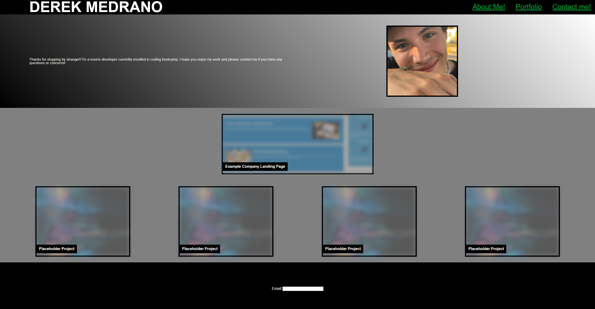

# <Portfolio>

## Description
    This is a portfolio/landing page for all my scholarly and professional work. My motivation behind this project is not only to get a good grade I need, but more importantly to be able to use and build on it throughout my career. I now have a permanent place to store and showcase all my work.
    I learned the value of using responisve elements, especially flexboxes and sizing elements.

## Installation
N/A
## Usage

User can see my information and work on previous projects all in a single page. Clicking the images will take the user to the respective websites. 
Site is designed to be responsive and will change format depending on screen size.
## Credits
w3schools
https://www.w3schools.com/css/default.asp

master media queries and responsive css web design...
https://www.youtube.com/watch?v=K24lUqcT0Ms

_______ RESET SHEET  ________
html5doctor.com Reset Stylesheet
v1.6.1
Last Updated: 2010-09-17
Author: Richard Clark - http://richclarkdesign.com
Twitter: @rich_clark

## License
N/A